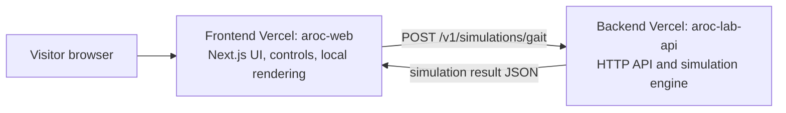

# Lab Simulation Backend Design

**Date:** 2026-07-14
**Status:** Approved for implementation planning

## Goal

Split AROC Lab into two independently deployed Vercel projects while making the Lab simulator feel more responsive. The existing Vercel project remains the Next.js frontend. A new Vercel project hosts a backend API for computationally richer gait simulation.

The UI must remain immediate while visitors adjust controls. The backend is used for bounded simulation calculations, not for per-frame animation or other latency-sensitive rendering.

## Scope

The first backend capability is a gait-parameter simulation. It evaluates multiple phases of an OP3-inspired walking cycle and returns a stability score, risk status, metrics, a time series, and parameter recommendations.

The existing Lab page keeps its three interactive views:

- Balance & Gait Tuner gains backend-powered simulation results.
- Vision Lock Simulator remains a client-side educational visualization.
- Signal Flow Console remains a client-side educational visualization, with its animation work reduced.

Results are not persisted in the first release. Authentication, user accounts, and a job queue are outside the scope of this release.

## Architecture



The codebase contains a new `backend/` directory with its own package manifest and Vercel configuration. The existing project root remains the frontend deployment root. A second Vercel project points to `backend/` in the same Git repository and is deployed separately.

The frontend receives the backend base URL through `NEXT_PUBLIC_LAB_API_URL`. The backend receives the allowed frontend origin through `ALLOWED_ORIGIN`. Production requests are accepted only from that configured origin. Local development accepts `http://localhost:3000` in addition to the configured origin.

## API Contract

### Health check

`GET /health` returns HTTP 200 with:

```json
{ "status": "ok", "service": "aroc-lab-api" }
```

### Gait simulation

`POST /v1/simulations/gait` accepts JSON:

```json
{
  "strideMm": 24,
  "periodMs": 600,
  "footClearanceMm": 40,
  "balanceGain": 74,
  "comHeightMm": 295,
  "lateralOffsetMm": 0,
  "steps": 120
}
```

The backend validates every field and rejects non-numeric, missing, or out-of-range values with HTTP 400. The accepted ranges are:

| Field | Accepted range |
|---|---:|
| `strideMm` | 0–70 |
| `periodMs` | 250–1200 |
| `footClearanceMm` | 10–90 |
| `balanceGain` | 0–100 |
| `comHeightMm` | 220–360 |
| `lateralOffsetMm` | -40–40 |
| `steps` | 24–240 |

A successful response returns HTTP 200:

```json
{
  "version": "1",
  "summary": {
    "stabilityScore": 82,
    "status": "STABLE",
    "recommendation": "Increase stride gradually while keeping cadence unchanged."
  },
  "metrics": {
    "minimumMargin": 0.18,
    "meanMargin": 0.31,
    "estimatedCadenceHz": 1.67,
    "riskFactors": []
  },
  "series": [
    { "phase": 0, "stability": 84, "roll": 0.02, "pitch": -0.01 },
    { "phase": 0.01, "stability": 83, "roll": 0.03, "pitch": -0.02 }
  ]
}
```

The simulation uses a deterministic model. For the same valid request body, it returns the same result. The first model assesses stride, cadence, foot clearance, balance gain, center-of-mass height, and lateral offset throughout a discretized walking cycle. It is intentionally an educational estimator and must not be represented as a physical safety model or a real-robot control command.

## Frontend Data Flow and Performance

The Gait Tuner retains local controls and immediate preview visuals. A change to a slider starts a 300 ms debounce timer. When the timer expires, the frontend sends the current parameter set to the backend.

- A new parameter change aborts the previous outstanding request with `AbortController`.
- The frontend derives a stable cache key from the complete request body. Cached results are shown immediately and refreshed only when the input differs.
- Only the response whose request token matches the newest controls can update the UI.
- While a result is pending, the previous valid chart remains visible with a small `Updating simulation` state. The UI does not clear or block controls.
- Network or server errors preserve the last valid result and show a compact retry action.

The Lab route also reduces work unrelated to the simulation:

- The global custom cursor is disabled on `/lab`.
- Gait animation pauses when its panel is not active, its document is hidden, or reduced motion is requested.
- Signal Flow limits displayed packet nodes and log rows, and updates its visual packets without unbounded React state growth.
- The backend is never called for frame-by-frame visual animation.

## Error Handling and Security

| Situation | Backend behavior | Frontend behavior |
|---|---|---|
| Invalid JSON or parameter | HTTP 400 with field-level error message | Keep last valid result and show the invalid input message |
| Origin not allowed | HTTP 403 | Show service-unavailable state without exposing configuration details |
| Unsupported HTTP method | HTTP 405 | Not applicable to normal UI flow |
| Unexpected simulation failure | HTTP 500 with a generic error code | Keep last valid result and offer Retry |
| Request superseded by newer controls | Request is aborted by browser | Ignore silently |
| Slow response | Current result remains visible | Show `Updating simulation`; do not block controls |

The API response contains no secrets. Environment values are configured only in Vercel and never committed. CORS permits only the frontend origin(s) described above. Input limits cap algorithmic work per request.

## Deployment

1. Create a new Vercel project named `aroc-lab-api` from this repository with `backend` as its Root Directory.
2. Configure `ALLOWED_ORIGIN` on the backend with the production frontend URL.
3. Deploy the backend and verify `GET /health`.
4. Configure `NEXT_PUBLIC_LAB_API_URL` on the existing frontend Vercel project with the backend deployment URL.
5. Deploy the frontend, then verify a Gait Tuner request reaches the new backend and renders its returned chart.

Preview deployments use a preview backend URL and a matching preview-origin configuration so CORS remains explicit during review.

## Testing and Acceptance Criteria

Backend tests cover validation boundaries, deterministic results, risk-status thresholds, CORS behavior, and error responses. Frontend tests cover debounce behavior, cancellation of stale requests, result caching, error recovery, and the rendering of returned series data.

The release is accepted when all of the following are true:

1. The existing frontend and new backend have separate Vercel deployment URLs.
2. The Lab Gait Tuner uses the backend endpoint for its detailed simulation result.
3. Slider interaction remains responsive while requests are pending.
4. A superseded request cannot overwrite a newer simulation result.
5. The Lab page avoids the identified always-running decorative work and respects reduced-motion preferences.
6. The application builds successfully and its production Gait Tuner flow is verified against the deployed backend.
